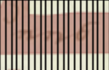

layout: true
  
<div class="my-header"></div>

<div class="my-footer">
  <table>
    <tr>
      <td style="text-align:right">Saxon State and University Library</td>
      <td>4th April 2025</td>
      <td style="text-align:right"><a href="https://www.slub-dresden.de/">www.slub-dresden.de</a></td>
    </tr>
    <tr>
      <td style="text-align:right">Research-related Services</td>
      <td />
    </tr>
  </table>
</div>

<div class="my-title-footer">
  <table>
    <tr>
      <td style="text-align:left"><b>Kay-Michael Würzner</b></td>
    </tr>
    <tr>
      <td style="text-align:left">Research-related Services</td>
    </tr>
    <tr>
      <td style="font-size:8pt"><b>4th April 2025</b></td>
    </tr>
    <tr>
      <td style="font-size:8pt">The Sounding Spirit Digital Library, Exhibition, and Convening</td>
    </tr>
  </table>
</div>

---

class: title-slide
count: false

# OCR for Sounding Spirit
## Methods, Results, Perspectives

---

# Overview

- How does OCR work?
- Showcase OCR results
- Working with OCR texts

---

class: part-slide
count: false

# How does OCR work?

---

# How does OCR work?

.cols[
.sixty[
- Image capture ≠ Text capture
- Optical Character Recognition (OCR): Automatic capture of text within images
    + Originally limited to character recognition
    + Today, usually synonymous with the entire text capture process
        * Image pre-processing
        * Layout analysis
        * Line recognition
        * ...
]
.fourty[
<center></center>
]
]

---

# Components of a Simple OCR Workflow

.cols[
.fifty[
]
.fourty[
<p style="margin-top:-20px">

</p>
]
]

---

count: false

# Components of a Simple OCR Workflow

.cols[
.fifty[
- Image preprocessing
]
.fourty[
<p style="margin-top:-20px">

</p>
]
]

---

count: false

# Components of a Simple OCR Workflow

.cols[
.fifty[
- Image preprocessing
]
.fourty[
<p style="margin-top:-20px">

</p>
]
]

---

count: false

# Components of a Simple OCR Workflow

.cols[
.fifty[
- Image preprocessing
- Layout analysis
]
.fourty[
<p style="margin-top:-20px">

</p>
]
]

---

count: false

# Components of a Simple OCR Workflow

.cols[
.fifty[
- Image preprocessing
- Layout analysis
]
.fourty[
<p style="margin-top:-20px">

</p>
]
]

---

count: false

# Components of a Simple OCR Workflow

.cols[
.fifty[
- Image preprocessing
- Layout analysis
    * **Structuring** elements
        + Paragraphs
        + Headings
]
.fourty[
<p style="margin-top:-20px">

</p>
]
]

---

count: false

# Components of a Simple OCR Workflow

.cols[
.fifty[
- Image preprocessing
- Layout analysis
    * **Structuring** elements
        + Paragraphs
        + Headings
    * **Text flow-interrupting** elements
        + Page numbers
        + Running head
        + Image captions
        + Marginal notes etc.
]
.fourty[
<p style="margin-top:-20px">

</p>
]
]

---

count: false

# Components of a Simple OCR Workflow

.cols[
.fifty[
- Image preprocessing
- Layout analysis
    * **Structuring** elements
        + Paragraphs
        + Headings
    * **Text flow-interrupting** elements
        + Page numbers
        + Running head
        + Image captions
        + Marginal notes etc.
    * **non-textual** elements
        + Figures
        + Tables etc.
]
.fourty[
<p style="margin-top:-20px">

</p>
]
]

---

count: false

# Components of a Simple OCR Workflow

.cols[
.fifty[
- Image preprocessing
- Layout analysis
    * **Structuring** elements
        + Paragraphs
        + Headings
    * **Text flow-interrupting** elements
        + Page numbers
        + Running head
        + Image captions
        + Marginal notes etc.
    * **non-textual** elements
        + Figures
        + Tables etc.
- Text recognition
]
.fourty[
<p style="margin-top:-20px">

</p>
]
]

---

# Excursus: Sequence Classification

- A central method in machine learning (cf. e.g., [Xing et al. 2010](https://www.cs.sfu.ca/~jpei/publications/Sequence%20Classification.pdf))  
- Based on **Bayes' theorem**: `\(P(C|E) = \frac{P(E|C)\cdot P(C)}{P(E)}\)`
- **Recipe:**  
  1. Take  
     - a **very large** list of **manually annotated** data, and  
     - a **training algorithm**.  
  2. Model an **`m:n` relationship** between input and output, for example:  
     - each letter is mapped to a class,  
     - each pixel strip is mapped to a letter,  
     - each word is mapped to a word class.  
  3. Generate a **statistical model** (e.g., HMMs, Conditional Random Fields, or Neural Networks).  
  4. Evaluate its quality using **evaluation data**.

---

# Excursus: Sequence Classification

- **Illustration using Hyphenation as a Simple Example**
    + **Data Source**:
        * [Wiktionary (English)](https://en.wiktionary.org/wiki/Wiktionary:Main_Page)
        * Hyphenation information for a large number of English words
        * Example: `electricity ↦ elec·tric·i·ty`
    + **Encoding Function** `\(f: \Sigma\rightarrow\mathbb{B}\)`
      $$
      f(x) = \begin{cases} 1 & x\,\text{followed by a hyphenation point} \\\\
      0 & \text{otherwise} \end{cases}
      $$
      ```
      e l e c t r i c i t y
      0 0 0 1 0 0 1 0 1 0
      ```
    + **Training Process**:
        * Counting sequences from input-output pairs
        * Calculating or estimating a probability distribution
        * Representing the results as a **statistical model**

---

# Excursus: Sequence Classification

- A **simple yet effective** algorithm used in various fields:
    + **Natural Language Processing (NLP)**, e.g.,
        * **Tokenization** (Characters → Word Boundaries)
        * **Part-of-Speech Tagging** (Words → Word Categories)
        * **Text Classification** (Texts → Text Types, `n:1` Problem)
    + **Bioinformatics**, e.g.,
        * **Protein Classification** in DNA Sequences (Nucleotide Bases → Amino Acids)
    + **Computer Vision**, e.g.,
        * **Layout Recognition** (Pixels → Layout Elements)
        * **Optical Character Recognition (OCR)** (Pixel Vectors → Letters)
- Numerous high-quality (Python) tutorials available, e.g.,
    + [Part-of-Speech Tagging with CRFs](https://albertauyeung.github.io/2017/06/17/python-sequence-labelling-with-crf.html/)
    + [DNA Sequencing with HMMs](https://github.com/jmschrei/pomegranate/blob/master/tutorials/B_Model_Tutorial_3_Hidden_Markov_Models.ipynb)
    + [Sentiment Analysis in Movie Reviews using Neural Networks](https://machinelearningmastery.com/sequence-classification-lstm-recurrent-neural-networks-python-keras/)

---

# Application to Text Recognition

- Recognition is performed *line by line*
  1. **Scaling:** Standardizing height for all lines
  2. **Feature Extraction:** Creating a grid with a fixed number of **horizontal** lines and a variable number of **vertical** columns → representing lines as sequences of binary-valued vectors of fixed length

<center></center>

- Context-sensitive recognition using *transition probabilities* of vectors
    + Requires segmentation of the page into *lines*
    + More robust against variation caused by artifacts compared to character-based approaches
- **Tools:** `Tesseract (from version 4)`, `OCRopus`, `kraken`, `Calamari`

---

# Application to Text Recognition

- Sequencing via Vectorization
    + **Scaling** to a uniform height
    + **Segmentation** into 1-pixel-wide strips

<center>

</center>
<center>
<p>↓</p>
</center>
<center>

</center>

---

# Application to Text Recognition

- Table with a fixed number of rows and a variable number of columns
- Black (1) and white (0) pixels
    + **Finite number** of possible configurations
- Characteristic sequence per character (and word)

.cols[
.fourty[
<center>

</center>
]
.ten[
<center>
<b>→</b>
</center>
]
.fourty[
<center>

</center>
]
]

---

# Application to Text Recognition

- Formally
    + **Data Source:**
        * [HTR United](https://htr-united.github.io/)
        * Manually transcribed lines of text
    + **Encoding Function:** `\(f: \mathbb{N}^{10}\rightarrow\mathbb{B}\)`  
      $$
      f(x[n]) = \begin{cases} 1 & \text{Pixel in cell } (x,n) \text{ is black} \\\\
      0 & \text{otherwise} \end{cases}
      $$
    + **Training Process:**
        * Counting sequences of vector–character-part pairs
        * Representing the results as an OCR model
        * Tool: Tesseract – [tesstrain](https://github.com/tesseract-ocr/tesstrain)

.cols[
.fifty[
```text
  0123456789
0 1111111111
2 0000110000
```
]
.fifty[
<center>

</center>
]
]


---

class: part-slide
count: false

# Showcase OCR results

---

class: part-slide
count: false

# Working with OCR texts

---

class: part-slide

# Many thanks for your attention!

<center>
<a href="https://wrznr.github.io/sounding-spirit-2025/">wrznr.github.io/sounding-spirit-2025</a>
</center>
